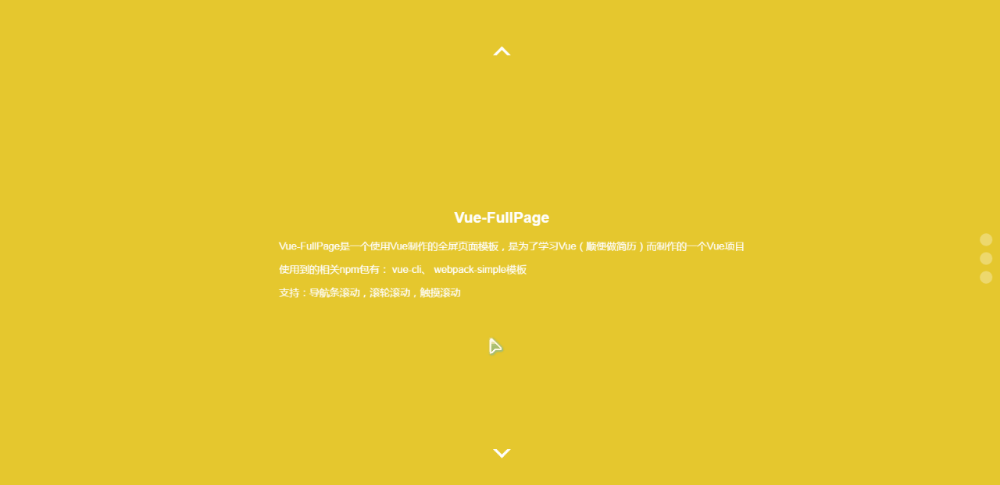
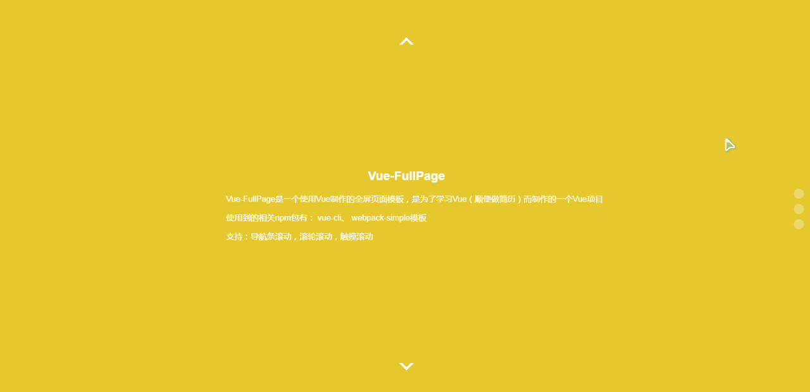
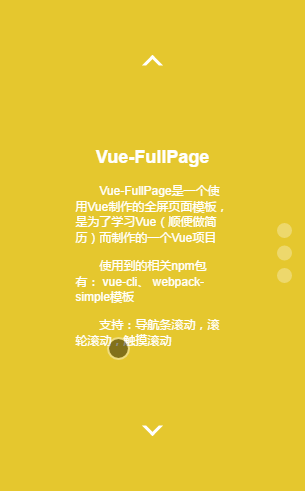

# vue-fullpage

[效果展示界面](http://hzxszsk.github.io/vue-fullpage/)

[总结文章](http://tianlajiangbula.com/2017/04/05/%E4%BD%BF%E7%94%A8vue%E5%88%B6%E4%BD%9Cfullpage%E9%A1%B5%E9%9D%A2/)

使用vue.js制作的一个fullpage模板，可以通过修改配置，添加任意数量的page，支持滚轮和触摸滚动

## 运行方式：

``` bash
# 安装依赖
npm/cnpm/yarn install

# 本地开发服务器
npm run dev

# 打包导出
npm run build
```

## 效果演示

- 箭头控制切换效果



- 右侧导航控制切换效果



- 移动端触屏切换效果



## 配置说明

在App.vue中修改data函数返回的内容，即为修改相应的配置。现在可以配置两个属性：currentPage和options

- currentPage: 表示当前显示的页面，通过设置currentPage可以改变初始显示的界面，可以自由扩展

- controllerOption: 该属性表示控制器的配置属性，可以自由扩展

    1. arrowsType: 表示页面控制器的上下箭头显示类型：false（不显示箭头）、true（显示箭头）、字符串animate（显示有动画效果的箭头）

    2. navbar: 表示是否显示侧边导航条

    3. highlight: 表示是否开启控制器当前页项高亮

    4. loop: 表示是否开启滚动循环（即滚到最后一页再向下或回到第一页，第一页向上滚也如此）

- options: 该属性是一个数组，数组的每一项都是一个对象，通过设置对象内的值，可以改变对应的page组件的样式

    1. background: 表示相应page的背景样式

    2. color: 表示相应page的文字颜色
    
    3. isCenter: 表示相应page的内容是否居中（包括水平居中和垂直居中）

    4. beforeLeave() 该方法表示在离开当前页面前所做的操作（参数为当前页面的vue组件实例）

    5. afterEnter() 方法表示在进入当前页面后所做的操作（参数为当前页面的vue组件实例）